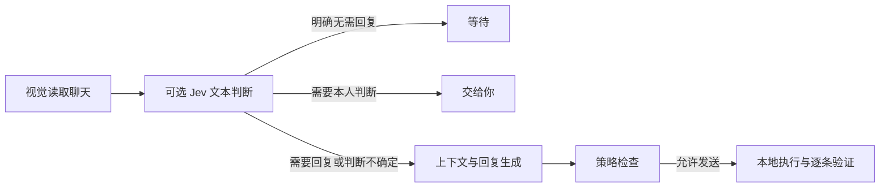

# Dating Booster

> **给 agent：**从 [`AGENTS.md`](AGENTS.md) 开始安装和接入。

**让 AI 记住每段对话，也跟上聊天的节奏。**

Dating Booster 是一个本地优先的开源聊天工作流，让 Codex、Claude Code、OpenClaw 和 Hermes 拥有持续的对话记忆、回复辅助与限时全托管能力。你决定聊多久、发多少、哪些事情亲自处理，agent 负责把上下文和操作衔接起来。

正在引入 **TypeSafe / Jev**：将“要不要回复、是否需要你接手”交给结构化语义判断，让视觉、生成和本地执行各司其职，减少重复分析与等待。

**Python 3.11+ · macOS GUI · 本地加密存储 · MIT 开源**

[为什么用 Jev](#为什么用-jev) · [快速开始](#给人类的快速开始) · [全托管](#全托管怎么用) · [支持范围](#当前支持范围) · [参与贡献](#参与贡献)

## 它能做什么

- **让对话接得上。** 本地记忆保存你的资料、对方的偏好、聊过的话题和约定，为下一次回复提供上下文。
- **让表达有自己的节奏。** 支持草稿辅助；开发版保留自然生成的 2–3 条短消息，一次规划后依次执行，无需把一组话反复交回 host 处理。
- **让多段聊天有条理。** 在你授权的时长与消息预算内，按优先级处理普通聊天，并汇总进度。
- **让重要决定留在你手里。** 你可以随时暂停、继续或停止；具体邀约、联系方式等需要本人判断的节点交回给你。

## 为什么用 Jev

聊天自动化里，许多步骤只需要回答一个小问题：**这条消息值得回复吗？现在应该等待吗？需要本人接手吗？** 如果每次都进入完整的分析和起草流程，操作之间的等待会不断累积。

Dating Booster 的 Jev 集成把这些判断从长流程中提出来：一次请求同时判断聊天边界和回复必要性，返回有限选项，由代码决定下一步。

| 分工 | 在工作流里做什么 |
| --- | --- |
| **视觉模型：看懂界面** | 读取聊天列表、会话正文与发送后的界面变化 |
| **TypeSafe / Jev：判断下一步** | 根据可见聊天文本，判断普通聊天／本人接手，以及回复／等待 |
| **生成模型：组织表达** | 结合记忆和上下文，起草单条回复或一组短消息 |
| **本地执行器：完成操作** | 管理队列、核对对象、写入输入框、发送并逐条验证 |



Jev 处理文字语义，视觉模型负责图像理解。明确可以等待的聊天直接跳过起草；判断不确定或服务不可用时，回到原有规划流程。是否允许发送，始终由授权与策略检查决定。

### 一次起草，连续表达

开发版将一组 2–3 条短消息作为一次完整回复规划。在同一执行循环内逐条发送和验证，组内不再重新调用 Jev、重新起草、重新扫描列表或等待 host 的下一轮操作。

输入框的读写与清空由 macOS 辅助功能（AX）检查，聊天正文和新增气泡由视觉核对。消息列表的短期队列也能复用，让时间花在新的对话内容上。每条消息独立计入预算；收到新来信后，尚未发送的尾条会取消，留给下一轮重新判断。

> **开发版集成：**Jev 与连发优化正在本地开发，尚未合入 `main`。[实现说明与 Jev 配置 →](docs/managed-run-performance.md)

## 当前支持范围

接入你已经在用的 agent：**Codex、Claude Code、OpenClaw、Hermes**。各 host 共用本地记忆、策略与应用适配层。

| App | 运行环境 | 接入方式 |
| --- | --- | --- |
| **她说 / TaShuo** | Apple Silicon Mac 上的本地 iOS app | 当前重点：`manage` 限时全托管、观察、导航与草稿 |
| 她说 / TaShuo | macOS iPhone Mirroring | `managed-session` / `host-loop` |
| Tinder / Bumble | macOS iPhone Mirroring | `managed-session` / `host-loop` |
| 微信 / WeChat | macOS 桌面端 | 已有关系的聊天延续与草稿、托管兼容路径 |

各 app 的具体动作见 [App 适配说明](app_profiles/README.md)。她说本地 app 与 iPhone Mirroring 分别选择使用；微信可在你确认是同一个人后，继承 dating app 中的关系记忆。

## 给人类的快速开始

### 把安装交给 agent

复制下面这段话给你的 Codex、Claude Code、OpenClaw 或 Hermes：

> 请安装 https://github.com/cyberpinkman/dating-booster ，先阅读 AGENTS.md，安装 CLI 和对应的 adapter，检查环境并帮我准备用户资料。先从回复辅助开始；我明确开启限时全托管后，再发送普通聊天消息。

### 手动安装

需要 **Python 3.11+**。真实界面操作需要 macOS；她说本地 iOS app 需要 Apple Silicon Mac、已安装并登录的 app，以及辅助功能和屏幕录制权限。

```bash
git clone https://github.com/cyberpinkman/dating-booster.git
cd dating-booster
python3 -m venv .venv
source .venv/bin/activate
python3 -m pip install -e .

# 以 Codex 为例；可替换为 claude-code、openclaw 或 hermes
dating-boost adapter codex install --scope user --json
dating-boost adapter codex doctor --data-dir .local/dating-boost --json
dating-boost release doctor --json
dating-boost data doctor --data-dir .local/dating-boost --json
```

若返回 `needs_migration`，初始化或迁移数据，再复查：

```bash
dating-boost data migrate --data-dir .local/dating-boost --json
dating-boost data doctor --data-dir .local/dating-boost --json
dating-boost capabilities --json --data-dir .local/dating-boost
```

后续使用同一虚拟环境和数据目录。更新源码后，重新执行 `pip install -e .` 和对应的 `adapter … install`，更新 agent 使用的 skill 副本。首次安装、更新、迁移或权限变化后检查环境；日常启动复用已有配置。

[Codex 安装指南](skills/dating-booster-codex/INSTALL.md) · [其他 agent 接入](agent_adapters/README.md)

## 全托管怎么用

以她说本地 app 为例，安装模型依赖，在运行 agent 的环境中设置 `MINIMAX_API_KEY`。当前默认由 MiniMax 提供视觉理解和回复生成。

```bash
python3 -m pip install -e ".[models]"
dating-boost runtime select --data-dir .local/dating-boost --app-id tashuo --runtime mac-ios-app --json
dating-boost user readiness --data-dir .local/dating-boost --mode autonomous --json
```

如果返回 `needs_user_profile`，先让 agent 帮你完成资料访谈。之后，用一句话设定本次范围：

> 全托管她说 2 小时，只回复普通聊天，最多发送 5 条，不主动追问，23:00–08:00 不发送。具体邀约和联系方式交给我。

Agent 会创建本次运行并持有执行进程。对应的 CLI 如下；`start` 保存授权窗口，`run --wait` 开始处理真实界面与消息：

```bash
dating-boost manage start \
  --data-dir .local/dating-boost \
  --duration-minutes 120 --send-budget 5 \
  --no-nudge --quiet-hours 23:00-08:00 --json

dating-boost manage run --data-dir .local/dating-boost --wait --poll-interval 30 --json
```

你随时可以说“查看进度”“暂停”“继续”或“停止”：

| 操作 | CLI | 行为 |
| --- | --- | --- |
| 查看进度 | `dating-boost manage status --data-dir .local/dating-boost --json` | 查看当前运行与对象进度 |
| 暂停 | `dating-boost manage pause --data-dir .local/dating-boost --json` | 在下一次界面修改前暂停，执行循环退出 |
| 继续 | `dating-boost manage resume --data-dir .local/dating-boost --json` | 恢复同一次运行，agent 随后重新启动 `run --wait` |
| 停止 | `dating-boost manage stop --data-dir .local/dating-boost --json` | 结束运行并返回进度报告 |

托管随执行进程结束而停止，不在窗口之外持续监听。主动跟进默认关闭，明确允许时使用 `--nudge`。

<details>
<summary>其他运行模式</summary>

Host-native 是默认路径：现有 agent 管理任务，普通草稿可由 host 起草，ManagedRun 在本地执行循环中调用模型。其他 app 沿用 `managed-session` / `host-loop`。独立入口 `standalone-session` 需显式选择；当前 standalone GUI executor 只支持 stage（暂存草稿），standalone live send 未启用。

</details>

## 安全与隐私

- **你的授权决定范围。** 默认只辅助回复或暂存草稿；普通聊天发送受时长、预算和安静时段约束。点赞、pass、unmatch、资料编辑、具体邀约、联系方式、通话和支付不自动执行。
- **每条操作有依据。** 发送前核对对象与输入文本，发送后核对结果；结果不确定时暂停，不自动重发。
- **记忆留在本地。** 业务数据使用加密 SQLite，macOS 默认由 Keychain 管理密钥。项目不发送网络遥测，不使用私有 API 或风控绕过。
- **模型数据流透明。** 视觉与生成服务处理当前任务所需内容；显式开启 Jev 时，必要的可见聊天文本会发送给 TypeSafe，不发送截图或整库记忆。诊断包默认脱敏。

## 本地数据

示例统一使用 `.local/dating-boost`。用 `data doctor` 检查数据，仅在提示需要时迁移。需要阻止后续草稿写入和发送时，可以启用全局暂停：

```bash
dating-boost safety pause --data-dir .local/dating-boost --reason manual-stop --json
dating-boost safety status --data-dir .local/dating-boost --json
```

## 参与贡献

欢迎一起改进 **Jev 的中文语义分流、消息节奏、应用适配与本地工作流**。可以从复现问题、补充脱敏用例、改进文档或提交代码开始。

新增 host 时复用共享契约；新增 app 时扩展应用适配层。这样，记忆、策略和执行逻辑可以持续服务于不同的 agent 与聊天环境。[架构与扩展指南 →](docs/ARCHITECTURE.md)

## 文档导航

| 你想了解 | 文档 |
| --- | --- |
| Agent 安装与执行规则 | [`AGENTS.md`](AGENTS.md) |
| Jev 集成、消息连发与性能设计 | [ManagedRun 开发说明](docs/managed-run-performance.md) |
| Codex / 其他 host 接入 | [Codex 安装](skills/dating-booster-codex/INSTALL.md) · [适配器目录](agent_adapters/README.md) |
| App 能力与扩展契约 | [`app_profiles/README.md`](app_profiles/README.md) |
| 架构、运行手册与维护资料 | [`docs/ARCHITECTURE.md`](docs/ARCHITECTURE.md) · [文档地图](docs/README.md) |

`docs/superpowers/` 保存历史设计与实施记录，不是用户操作手册。

## 验证

离线安装检查使用独立测试目录，不打开 app、不调用真实模型、不发送消息：

```bash
DATING_BOOST_KEY_PROVIDER=local \
python3 scripts/agent_native_smoke.py --data-dir .local/dating-boost-smoke
```

开发者在已激活的虚拟环境中运行常规回归：

```bash
python3 -m pip install -e ".[test]"
python3 -m pytest -m "not nightly_lab" -q
```

完整测试（含夜间协议）：`python3 -m pytest -q`。开发记录与分阶段测量见 [ManagedRun 开发说明](docs/managed-run-performance.md)。

## 许可证

[MIT License](LICENSE)。
