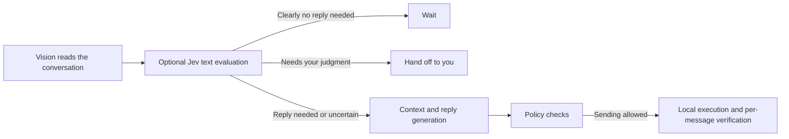

# Dating Booster

**English** | [简体中文](README.zh-CN.md)

> **For agents:** Start with [`AGENTS.md`](AGENTS.md) for installation and integration.

**Help your AI remember each conversation and keep up with its pace.**

Dating Booster is a local-first, open-source chat workflow that gives Codex, Claude Code, OpenClaw, and Hermes persistent conversation memory, drafting assistance, and time-limited managed chat. You decide how long it runs, how many messages it can send, and which decisions need your attention. The agent connects that context to the next action.

We're integrating **TypeSafe / Jev** to answer bounded questions such as "Does this need a reply?" and "Should the user take over?" Vision, generation, and local execution each have a specific job, reducing repeated analysis and waiting.

**Python 3.11+ · macOS GUI · Encrypted local storage · MIT licensed**

[Why Jev](#why-jev) · [Quick start](#quick-start) · [Managed mode](#using-managed-mode) · [Supported apps](#supported-apps-and-hosts) · [Contributing](#contributing)

## What it does

- **Keeps conversations connected.** Local memory stores your profile, the other person's preferences, past topics, and commitments to give the next reply context.
- **Preserves the rhythm of a reply.** Use drafting assistance, or try the development build's support for 2–3 short messages: plan the group once, then execute it in sequence without handing each message back to the host agent.
- **Organizes multiple conversations.** Within your authorized time window and message budget, it prioritizes ordinary chat and reports progress.
- **Leaves important decisions with you.** Pause, resume, or stop at any time. Specific meeting arrangements, contact exchanges, and other decisions that need your judgment come back to you.

## Why Jev

Many steps in chat automation only need a small decision: **Does this message need a reply? Should we wait? Does the user need to take over?** Sending each one through a full analysis and drafting cycle adds waiting between actions.

Dating Booster's Jev integration separates these decisions from the longer workflow. One request evaluates both the conversation's boundaries and whether a reply is needed. It returns choices from a defined set, and code decides what happens next.

| Component | Role in the workflow |
| --- | --- |
| **Vision model: read the interface** | Reads the message list, conversation text, and interface changes after sending |
| **TypeSafe / Jev: choose the next step** | Uses visible chat text to assess ordinary chat versus user handoff, and reply versus wait |
| **Generative model: compose the reply** | Combines memory and context to draft one message or a short sequence |
| **Local executor: carry out the actions** | Manages the queue, checks the intended conversation, fills the composer, sends, and verifies each message |



Jev evaluates text; the vision model interprets images. Conversations that clearly allow waiting skip drafting. Uncertain results or an unavailable service fall back to the existing planner. Authorization and policy checks always determine whether sending is allowed.

### Draft once, send as a sequence

The development build plans a group of 2–3 short messages as one reply. It sends and verifies them individually within the same execution loop, without repeating Jev calls, drafting, list scans, or waiting for the host agent's next turn between messages.

macOS Accessibility (AX) checks the composer's contents and whether it clears after sending. Vision verifies conversation text and new message bubbles. A short-lived candidate queue also avoids repeated message-list scans. Each message counts separately against the budget. If a new message arrives, the unsent tail is canceled so the next cycle can reassess the conversation.

> **Development integration:** Jev and the message-sequence improvements are in local development and have not yet been merged into `main`. [Implementation notes and Jev configuration →](docs/managed-run-performance.md)

## Supported apps and hosts

Use the agent you already work with: **Codex, Claude Code, OpenClaw, or Hermes**. All hosts share the same local memory, policies, and app adapters.

| App | Environment | Integration |
| --- | --- | --- |
| **TaShuo / 她说** | Native iOS app on an Apple Silicon Mac | Current focus: time-limited managed chat through `manage`, observation, navigation, and drafts |
| TaShuo / 她说 | macOS iPhone Mirroring | `managed-session` / `host-loop` |
| Tinder / Bumble | macOS iPhone Mirroring | `managed-session` / `host-loop` |
| WeChat / 微信 | macOS desktop app | Continuing existing relationships, drafts, and the compatibility path for managed chat |

See [app support profiles](app_profiles/README.md) for each app's supported actions. Choose either the native TaShuo app or iPhone Mirroring as your runtime. WeChat can inherit relationship memory from a dating app after you confirm that both profiles belong to the same person.

## Quick start

### Let your agent handle setup

Give this prompt to Codex, Claude Code, OpenClaw, or Hermes:

> Install https://github.com/cyberpinkman/dating-booster. Read AGENTS.md first, install the CLI and the adapter for your host, check the environment, and help me set up my profile. Start with drafting assistance. Send ordinary chat messages only after I explicitly authorize a time-limited managed session.

### Install manually

Requires **Python 3.11+**. Real GUI operations require macOS. The native TaShuo iOS app also requires an Apple Silicon Mac, an installed and signed-in app, and Accessibility and Screen Recording permissions.

```bash
git clone https://github.com/cyberpinkman/dating-booster.git
cd dating-booster
python3 -m venv .venv
source .venv/bin/activate
python3 -m pip install -e .

# Codex example; replace with claude-code, openclaw, or hermes as needed
dating-boost adapter codex install --scope user --json
dating-boost adapter codex doctor --data-dir .local/dating-boost --json
dating-boost release doctor --json
dating-boost data doctor --data-dir .local/dating-boost --json
```

If the result is `needs_migration`, initialize or migrate the data, then check again:

```bash
dating-boost data migrate --data-dir .local/dating-boost --json
dating-boost data doctor --data-dir .local/dating-boost --json
dating-boost capabilities --json --data-dir .local/dating-boost
```

Keep using the same virtual environment and data directory. After updating the source, rerun `pip install -e .` and the appropriate `adapter … install` command to update the skill copy used by your agent. Check compatibility after installation, updates, migration, or permission changes; everyday runs reuse the existing configuration.

[Codex installation guide](skills/dating-booster-codex/INSTALL.md) · [Other host adapters](agent_adapters/README.md)

## Using managed mode

For the native TaShuo app, install the model dependencies and set `MINIMAX_API_KEY` in the environment where your agent runs. MiniMax currently provides vision and reply generation by default.

```bash
python3 -m pip install -e ".[models]"
dating-boost runtime select --data-dir .local/dating-boost --app-id tashuo --runtime mac-ios-app --json
dating-boost user readiness --data-dir .local/dating-boost --mode autonomous --json
```

If this returns `needs_user_profile`, ask your agent to help you complete the profile interview first. Then describe the scope of this run:

> Manage TaShuo for two hours. Reply only to ordinary chat, send at most five messages, don't send proactive follow-ups, and stay quiet from 23:00 to 08:00. Leave specific meeting arrangements and contact exchanges to me.

The agent creates the run and keeps its execution process open. The equivalent CLI commands are below: `start` saves the authorization window; `run --wait` begins working with the real interface and messages.

```bash
dating-boost manage start \
  --data-dir .local/dating-boost \
  --duration-minutes 120 --send-budget 5 \
  --no-nudge --quiet-hours 23:00-08:00 --json

dating-boost manage run --data-dir .local/dating-boost --wait --poll-interval 30 --json
```

You can ask to check progress, pause, resume, or stop at any time:

| Action | CLI | Behavior |
| --- | --- | --- |
| Check progress | `dating-boost manage status --data-dir .local/dating-boost --json` | Shows the current run and progress for each conversation |
| Pause | `dating-boost manage pause --data-dir .local/dating-boost --json` | Pauses before the next GUI change and exits the execution loop |
| Resume | `dating-boost manage resume --data-dir .local/dating-boost --json` | Resumes the same run; the agent then restarts `run --wait` |
| Stop | `dating-boost manage stop --data-dir .local/dating-boost --json` | Ends the run and returns a progress report |

Managed activity ends when the execution process exits. It does not keep listening outside the authorized window. Proactive follow-ups are off by default; use `--nudge` only when explicitly authorized.

<details>
<summary>Other execution modes</summary>

The default is host-native: your existing agent manages the task and can draft ordinary replies, while ManagedRun calls models inside its local execution loop. Other apps continue to use `managed-session` / `host-loop`. The separate `standalone-session` entry point requires an explicit choice; its GUI executor currently supports staging drafts only, with live sending disabled.

</details>

## Safety and privacy

- **Your authorization sets the scope.** The default is drafting assistance or staging. Ordinary chat sends are limited by duration, budget, and quiet hours. Likes, passes, unmatches, profile edits, specific meeting arrangements, contact exchanges, calls, and payments are not performed automatically.
- **Each action needs evidence.** The system checks the intended conversation and input text before sending, then verifies the result. Uncertain outcomes pause the run without automatic resending.
- **Memory stays local.** Application data is stored in encrypted SQLite, with macOS Keychain managing keys by default. The project sends no network telemetry and uses no private APIs or methods to bypass platform safeguards.
- **Model data flows are explicit.** Vision and generation services process the content needed for the current task. When Jev is explicitly enabled, the necessary visible chat text is sent to TypeSafe; screenshots and the full memory database are not. Diagnostic bundles are redacted by default.

## Local data

The examples use `.local/dating-boost` throughout. Check it with `data doctor` and migrate only when prompted. To block subsequent draft staging and sending, enable the global pause:

```bash
dating-boost safety pause --data-dir .local/dating-boost --reason manual-stop --json
dating-boost safety status --data-dir .local/dating-boost --json
```

## Contributing

Help improve **Jev routing for Chinese conversations, message pacing, app adapters, and local workflows**. Useful contributions include reproducing issues, sharing redacted examples, improving documentation, and submitting code.

New hosts should reuse the shared contracts; new apps should extend the app adapter layer. This keeps memory, policies, and execution reusable across agents and chat environments. [Architecture and extension guide →](docs/ARCHITECTURE.md)

## Documentation

| Topic | Documentation |
| --- | --- |
| Agent installation and execution rules | [`AGENTS.md`](AGENTS.md) |
| Jev integration, message sequences, and performance design | [ManagedRun development notes](docs/managed-run-performance.md) |
| Codex and other host integrations | [Codex installation](skills/dating-booster-codex/INSTALL.md) · [Adapter directory](agent_adapters/README.md) |
| App capabilities and extension contracts | [`app_profiles/README.md`](app_profiles/README.md) |
| Architecture, runbooks, and maintenance | [`docs/ARCHITECTURE.md`](docs/ARCHITECTURE.md) · [Documentation index](docs/README.md) |

`docs/superpowers/` contains historical design and implementation records, rather than user operating instructions.

## Verification

The offline installation check uses a separate test directory. It does not open an app, call real models, or send messages:

```bash
DATING_BOOST_KEY_PROVIDER=local \
python3 scripts/agent_native_smoke.py --data-dir .local/dating-boost-smoke
```

Run the regular regression suite from your activated virtual environment:

```bash
python3 -m pip install -e ".[test]"
python3 -m pytest -m "not nightly_lab" -q
```

For the full suite, including nightly protocols, run `python3 -m pytest -q`. See the [ManagedRun development notes](docs/managed-run-performance.md) for implementation history and measurements of individual stages.

## License

[MIT License](LICENSE).
